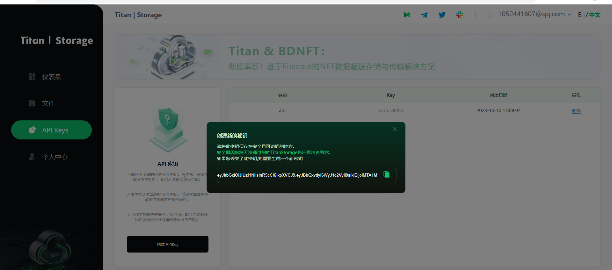

## 1 Build
    git clone https://github.com/zscboy/storage-upload-sample.git
    cd storage-upload-sample
    go build

## 2 Test
### 2.1 Register from https://storage.titannet.io, and create API Key

### 2.2 upload file
./storage-upload-sample --api-key YOUR-API-KEY --locator-url https://locator.titannet.io:5000/rpc/v0 YOUR-FILE